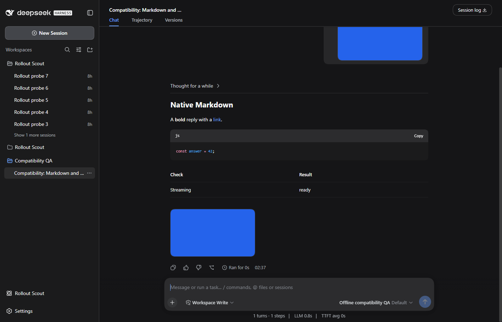
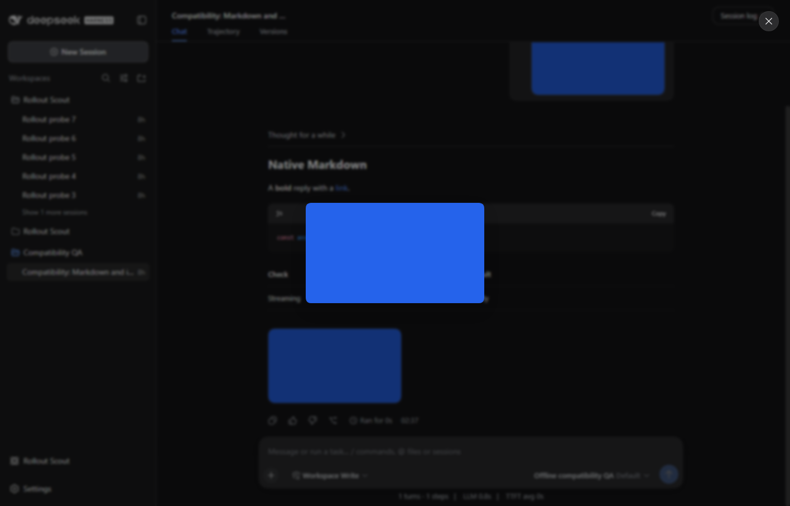
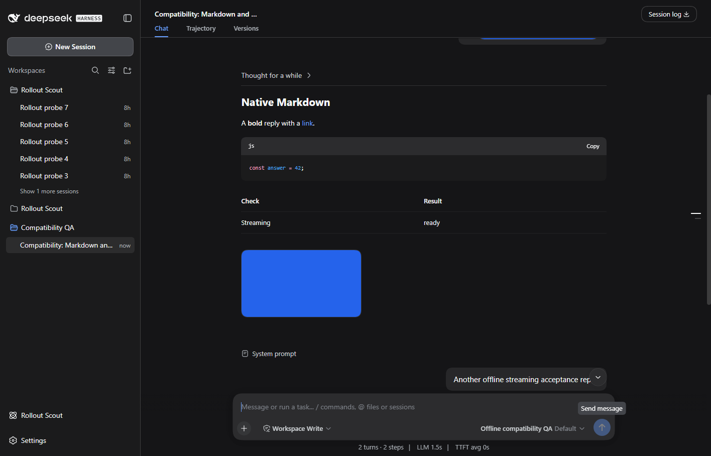
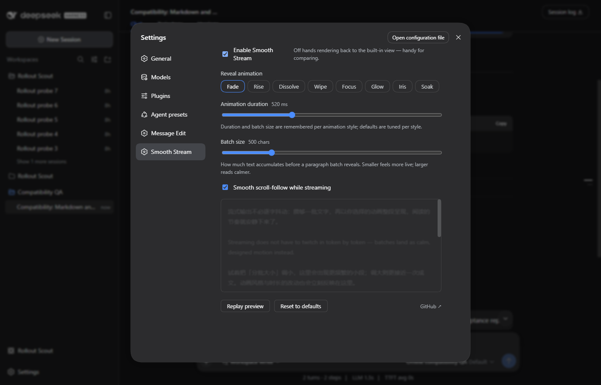

# DSH 0.1.2-rc.1 compatibility

Reviewed on 2026-09-07; npm latest and next both resolve to 0.1.2-rc.1.

Wait for the client services before registering the renderer. Resolve memoized native Markdown through the module loader, forward its current labels/streaming props, and delegate assistant attachments to the host image gallery.

## Validation

Client loading and React/jsdom rendering regressions pass, including streaming transitions, localized labels and attachment ordering. The actual npm archive builds and validates.

The real DSH checks used a new disposable home, locally generated attachments and an offline model, with all four plugins installed together. No existing user conversations or remote model credentials were used. The isolated server was stopped after checks.

## Browser acceptance

Passed in an isolated Microsoft Edge test process against the official DSH 0.1.2-rc.1 Web runtime. All four plugins were installed together, with synthetic attachments and a local streaming model.

The real UI renders native Markdown headings, highlighted code, tables and both user/assistant images. The original-image viewer opens and closes. A new prompt produces a complete reply using the local streaming adapter. Settings and their preview render, and disabling/enabling restores the native/custom renderer. Chat labels bind the host locale, and reasoning respects the host process fold.

No application console errors were recorded. The test browser was closed in the runner cleanup.

