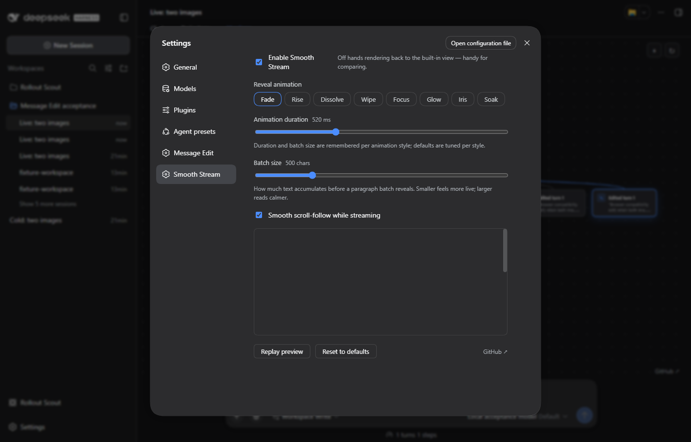

# DSH 0.1.5-rc.2 compatibility

Verified on 2026-09-20 against npm latest/next `0.1.5-rc.2`. The alpha tag is `0.1.6-alpha.2` and is outside this release's declared range.

Declare the current UI renderer service provider and the verified DSH release range. Existing rendering behavior passes the current host checks.

## Validation

`npm test` and `npm run check:package` pass.

Client loading and component rendering regressions pass. In the real browser the assistant renderer displays the offline reply alongside Message Edit image thumbnails. The settings panel mounts, renders all eight effects and its preview, and toggles the renderer off and back on without application console errors.

All four SpookySandwich plugins were loaded together in a separate DSH home using the official published CLI/Web packages, generated images and a deterministic offline model. No remote model service was exercised. Browser runs own and close their separate headless Edge process; user profiles and conversations are not test targets.

